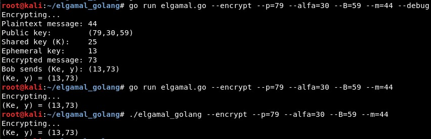
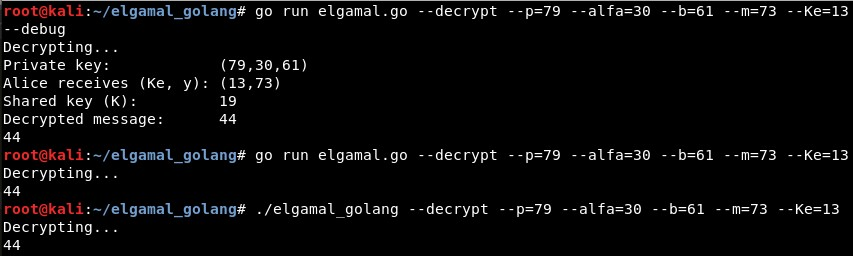
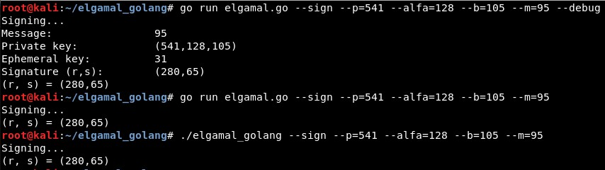
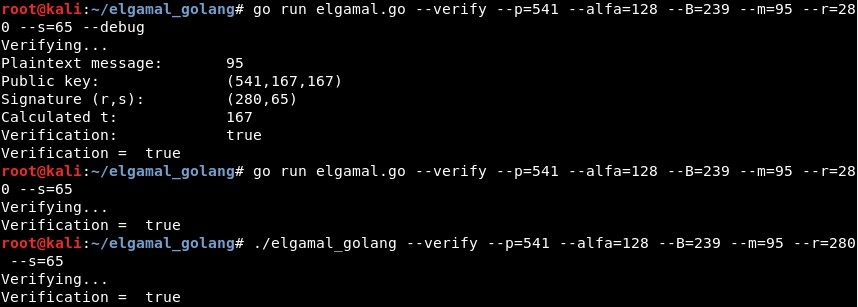

# Elgamal

Implementation of Elgamal algorithm in Golang, based on [these series of videos](https://www.youtube.com/watch?v=6ARDqCckjfs) (the parameter nomenclature is based on them).


Public and private keys are composed of 3 elements each:

- Kpub = (p, alfa, B)

- Kpriv = (p, alfa, b)

These parameters are:

- p (parameter **--p**): A random integer

- alfa (parameter **--alfa**): A generator of Zp

- b (parameter **--b**): A secret integer between 2 and (p-2)

- B (parameter **--B**): A public modular exponentiation calculated as B = (alfa^(b))mod(p)


### Encryption

For the encryption process, it is necessary to add **--encrypt**, the parameters of the public key (**--p**, **--alfa** and **--B**) and the plaintext message (parameter **--m**). The verbose parameter (**--debug**) is optional:

``` 
go run elgamal.go --encrypt --p=79 --alfa=30 --B=59 --m=44 --debug
``` 




### Decryption

For the decryption process, it is necessary to add **--decrypt**, the parameters of the private key (**--p**, **--alfa** and **--b**), the encrypted message (parameter **--m**) and the ephemeral key received with the message (**--Ke**). The verbose parameter (**--debug**) is optional:

``` 
go run elgamal.go --decrypt --p=79 --alfa=30 --b=61 --m=73 --Ke=13 --debug
``` 




### Signature

For the signing process, it is necessary to add **--sign**, the parameters of the private key (**--p**, **--alfa** and **--b**) and the plaintext message (parameter **--m**). The verbose parameter (**--debug**) is optional:

``` 
go run elgamal.go --sign --p=541 --alfa=128 --b=105 --m=95 --debug
``` 




### Signature verification

For the signature verification process, it is necessary to add **--verify**, the parameters of the public key (**--p**, **--alfa** and **--B**), the plaintext message (parameter **--m**) and the signature parameters (**--r** and **--s**). The verbose parameter (**--debug**) is optional:

``` 
go run elgamal.go --verify --p=541 --alfa=128 --B=239 --m=95 --r=280 --s=65 --debug
``` 



----------------------------------------

## Note 

This is a rewrite of (this repository)[https://github.com/ricardojoserf/elgamal-python] which has the same functionality but written in Python.